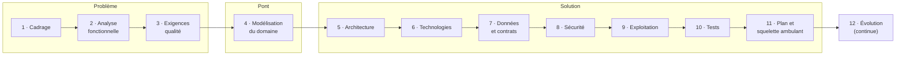

# Conception logicielle pilotée par l'IA

Un guide complet pour **concevoir une application de A à Z en dialogue avec une IA (intelligence artificielle)** : du besoin métier jusqu'au premier incrément de code, en passant par les exigences qualité, le domaine, l'architecture, les technologies, les données, la sécurité, l'exploitation et les tests.

Le guide est à la fois :

- une **convention de conception** lisible par un humain : méthode, livrables, listes de contrôle ;
- un **programme de travail pour un agent IA** : un orchestrateur ([`AGENTS.md`](AGENTS.md)), onze prompts de spécialistes ([`prompts/`](prompts/)) et des gabarits de livrables ([`templates/`](templates/)).

L'IA structure, questionne, rédige, vérifie la cohérence et propose. **L'humain — le décideur — connaît le métier, arbitre et valide.**

---

## Le processus



| # | Phase | Question centrale | Méthodes de référence |
|---|---|---|---|
| 1 | [Cadrage](docs/01-cadrage.md) | Pourquoi, pour qui, dans quelles limites ? | Vision produit, parties prenantes, objectifs mesurables |
| 2 | [Analyse fonctionnelle](docs/02-analyse-fonctionnelle.md) | Que doit faire le système ? | Volere, Example Mapping, cas d'utilisation |
| 3 | [Exigences qualité](docs/03-exigences-qualite.md) | Avec quel niveau de qualité ? | Scénarios qualité, ISO (International Organization for Standardization) 25010 |
| 4 | [Modélisation du domaine](docs/04-modelisation-domaine.md) | Comment le métier est-il structuré ? | DDD (Domain-Driven Design) stratégique, Event Storming |
| 5 | [Architecture logicielle](docs/05-architecture-logicielle.md) | Comment organiser le système ? | arc42, C4 (Context, Containers, Components, Code), ADR (Architecture Decision Record) |
| 6 | [Choix technologiques](docs/06-choix-technologiques.md) | Avec quels outils ? | Grille pondérée, preuves de concept |
| 7 | [Données et contrats](docs/07-donnees-contrats.md) | Quelles données, quelles interfaces ? | OpenAPI, AsyncAPI, propriété des données |
| 8 | [Sécurité et conformité](docs/08-securite-conformite.md) | Contre quoi se protéger ? | STRIDE (Spoofing, Tampering, Repudiation, Information disclosure, Denial of service, Elevation of privilege), ASVS (Application Security Verification Standard), RGPD (Règlement général sur la protection des données) |
| 9 | [Infrastructure et exploitation](docs/09-infrastructure-exploitation.md) | Où et comment tourne-t-il ? | SLO (Service Level Objective), infrastructure décrite par du code, observabilité |
| 10 | [Stratégie de test](docs/10-strategie-test.md) | Comment prouver la conformité ? | Pyramide des tests, fonctions d'aptitude |
| 11 | [Plan de réalisation](docs/11-plan-realisation.md) | Dans quel ordre construire ? | Squelette ambulant, tranches verticales |
| 12 | [Évolution](docs/12-evolution.md) | Comment la conception reste-t-elle vraie ? | Gestion du changement, garde-fous automatiques |

Chaque phase suit la même boucle — **Charger → Questionner → Proposer → Critiquer → Valider → Consigner → Gate** — et se termine par une **gate** que seul le décideur peut valider.

Ce n'est pas un cycle en cascade : l'ordre dit dans quel sens circule l'information, et les retours en arrière sont prévus et encadrés.

## Principes clés

1. **L'IA n'invente jamais une donnée métier.** Un seuil inconnu est marqué **[seuil à fixer]** et devient une décision ouverte.
2. **Tout est identifié et tracé** : chaque exigence a un identifiant stable (`BR-7`, `QS-3`, `ADR-0004`…), et la chaîne va de l'objectif métier jusqu'au test.
3. **Les exigences qualité pilotent l'architecture**, pas la mode.
4. **Une décision structurante = un ADR**, avec au moins deux options comparées.
5. **L'effort est proportionné** au profil du projet : *Prototype*, *Produit* ou *Critique*.
6. **La conception vit dans des fichiers**, dans le dépôt du projet : un agent peut reprendre le travail sans l'historique de la conversation.

Détails : [`docs/00-principes.md`](docs/00-principes.md).

## Structure du dépôt

```
.
├── AGENTS.md             # Point d'entrée de l'agent : orchestrateur, routage, commandes
├── CLAUDE.md             # Import de AGENTS.md pour Claude Code
├── docs/
│   ├── 00-principes.md   # Normatif : rôles, boucle, règles d'or, identifiants, gates
│   ├── 01 … 12-*.md      # Une fiche de méthode par phase
│   ├── glossaire.md      # Acronymes et termes
│   └── bibliographie.md  # Ouvrages et références
├── prompts/              # Un prompt par spécialiste + relecteur critique
├── templates/            # Gabarits des livrables écrits dans conception/
└── scripts/
    └── check_acronyms.py # Vérifie le glossaire et l'expansion des acronymes
```

Dans le projet conçu, l'agent produit :

```
conception/
├── ETAT.md  glossaire.md  tracabilite.md
├── 01-cadrage.md … 11-plan-realisation.md
├── adr/  contrats/  diagrammes/
```

## Démarrage rapide

### 1. Rendre le guide accessible à l'agent

Au choix :

```bash
# a) Cloner le guide à côté de vos projets
git clone https://github.com/ArnaudSene/ai-driven-software-design.git ~/guides/ai-driven-software-design

# b) Ou l'ajouter comme sous-module du projet
git submodule add https://github.com/ArnaudSene/ai-driven-software-design.git .guide-conception
```

### 2. Lancer la session de conception

Ouvrez votre agent (Claude Code, ou tout agent capable de lire et d'écrire des fichiers) **à la racine du projet à concevoir**, puis envoyez :

```text
Tu vas conduire la conception de ce projet en suivant le guide situé dans
<chemin-du-guide>. Lis d'abord <chemin-du-guide>/AGENTS.md et applique-le :
tu es l'orchestrateur, je suis le décideur. Les livrables vont dans ./conception/.
Voici mon projet : <description en quelques lignes, et documents disponibles>.
```

Si vous avez déjà des documents (analyse fonctionnelle, cahier des charges…), où qu'ils soient, et si vous voulez écrire les livrables ailleurs que dans `./conception/` :

```text
Tu vas conduire la conception de ce projet en suivant le guide situé dans
<chemin-du-guide>. Lis d'abord <chemin-du-guide>/AGENTS.md et applique-le.
Sources à reprendre (lecture seule) : <chemin ou adresse de chaque document>.
Les livrables vont dans : <répertoire de destination>.
Travaille en mode Proposition : transpose mes documents au format du guide,
cite-les comme sources, et ne me questionne que sur ce qui manque, est ambigu
ou contradictoire.
```

L'agent enregistre ces emplacements dans `conception.config.yaml` à la racine du projet (gabarit : [`templates/conception.config.yaml`](templates/conception.config.yaml)) pour les retrouver aux sessions suivantes. Vous pouvez aussi écrire ce fichier vous-même avant de lancer la session.

Pour reprendre plus tard, dans une nouvelle conversation :

```text
Reprends la conception de ce projet selon <chemin-du-guide>/AGENTS.md.
```

L'agent relit `conception.config.yaml` s'il existe, puis `ETAT.md` dans le répertoire de conception, et repart de là où vous vous étiez arrêtés.

### 3. Dialoguer

| Vous dites | L'agent |
|---|---|
| « État » | Résume la phase, les gates, les décisions ouvertes, la prochaine action. |
| « Continue » | Passe à la prochaine action. |
| « Je ne sais pas » | Ouvre une décision ouverte et avance sans bloquer. |
| « Mode proposition » | Rédige un brouillon complet à partir de vos documents, puis vous soumet les points à confirmer. |
| « Revue critique » | Fait relire la phase par un relecteur adversarial. |
| « Je valide G3 » | Enregistre la gate et passe à la phase suivante. |
| « Reviens à la phase 2 » | Applique la procédure de changement et liste les impacts. |

Liste complète : [`AGENTS.md` § 7](AGENTS.md#7-commandes-du-décideur).

## Contribuer au guide

- Le guide est rédigé en français ; les scripts sont en anglais.
- À la première occurrence d'un acronyme dans chaque fichier, sa forme développée est donnée entre parenthèses, et tout acronyme figure dans le [glossaire](docs/glossaire.md).
- Avant de proposer une modification :

```bash
python3 scripts/check_acronyms.py
```

## Références

Voir la [bibliographie](docs/bibliographie.md).

## Licence

Distribué sous licence MIT (Massachusetts Institute of Technology) : vous pouvez utiliser, copier, modifier et redistribuer le guide, y compris dans un cadre commercial, à condition de conserver la mention de copyright. Voir [`LICENSE`](LICENSE).
