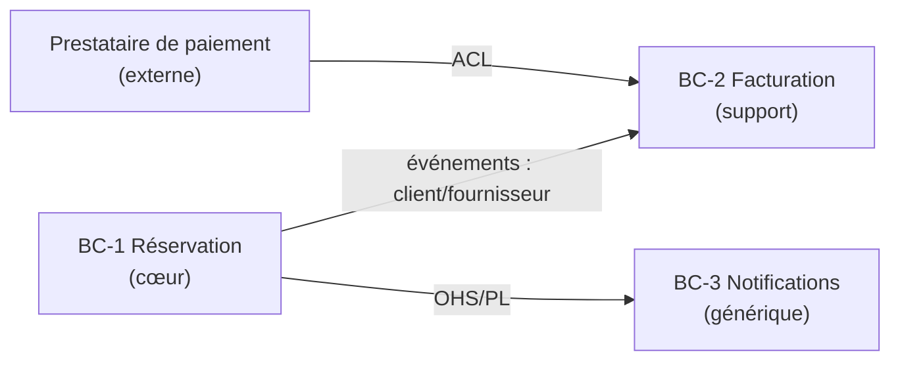

# Phase 4 — Modélisation du domaine

| Clé | Valeur |
|---|---|
| Question centrale | Comment le métier est-il structuré, et où tracer les frontières ? |
| Agent | [`prompts/modelisateur-domaine.md`](../prompts/modelisateur-domaine.md) |
| Entrées | Phases 1 à 3 validées, `glossaire.md` |
| Sorties | `conception/04-domaine.md`, `glossaire.md` bilingue, `diagrammes/` |
| Identifiants créés | `BC-n` |
| Gabarit | [`templates/04-domaine.md`](../templates/04-domaine.md) |
| Gate | G4 |

---

## 1. Pourquoi cette phase

Elle fait le pont entre le problème (phases 1 à 3) et la solution (phases 5 à 11). Elle répond à trois questions qui conditionnent toute l'architecture :

1. **Quels mots** utilise-t-on, avec quel sens exact ? (langage omniprésent)
2. **Où sont les frontières** naturelles du métier ? (contextes délimités)
3. **Où investir** l'effort de conception ? (classification des sous-domaines)

La méthode est celle du DDD (Domain-Driven Design, conception pilotée par le domaine) d'Eric Evans, dans sa partie **stratégique**. La partie tactique (agrégats, entités, objets valeur) est amorcée ici et détaillée en phases 5 et 7.

## 2. Concepts et méthodes

### 2.1 Event Storming

Technique d'atelier d'Alberto Brandolini. On reconstitue le métier sous la forme d'une **chronologie d'événements métier**, écrits au passé (« Réservation confirmée »). L'agent la conduit en trois passes :

| Passe | Contenu | Résultat |
|---|---|---|
| **Vue d'ensemble** | Tous les événements métier dans l'ordre chronologique, de bout en bout. Points chauds (désaccords, zones floues) signalés. | Une frise lisible par le métier |
| **Processus** | Pour chaque événement : la **commande** qui le provoque, l'**acteur** ou la **politique** (« quand X, alors Y ») qui la déclenche, les **systèmes externes**, les **informations lues** pour décider. | Les flux et les automatismes |
| **Conception** | Regroupement des commandes et événements autour des **agrégats** qui garantissent les règles. | Les frontières de cohérence |

Notation textuelle utilisée par l'agent (lisible sans outil, facile à transformer en Mermaid) :

```
[Acteur: Client] → (Commande: Réserver un créneau) → {Agrégat: Réservation}
    ⇒ <Événement: Réservation demandée>
    ⇒ «Politique: quand Réservation demandée, bloquer le créneau pendant 10 min»
    ?? Point chaud: que se passe-t-il si le paiement échoue après 10 min ? → OD-5
```

Chaque point chaud devient une OD (décision ouverte). Chaque politique renvoie à une ou plusieurs `BR-n`.

### 2.2 Langage omniprésent

Un vocabulaire **unique et partagé** par le métier, la documentation et le code, **à l'intérieur d'un contexte délimité**. Le même mot peut légitimement avoir deux sens dans deux contextes différents (« Client » pour la facturation et pour le support), mais jamais deux sens dans le même contexte.

Le glossaire du projet est bilingue, conformément à la règle d'or 13 :

| Terme | Contexte | Définition | Nom dans le code | Synonymes proscrits |
|---|---|---|---|---|
| Réservation | `BC-1` Réservation | Engagement d'un client sur un créneau, de la demande à l'annulation ou à la réalisation | `Booking` | « commande », « résa » |
| Créneau | `BC-1` Réservation | Plage horaire réservable d'une ressource | `Slot` | « horaire », « plage » |
| Avoir | `BC-2` Facturation | Montant dû au client, utilisable sur un achat futur | `CreditNote` | « bon », « remboursement » |

### 2.3 Sous-domaines

| Type | Définition | Stratégie |
|---|---|---|
| **Cœur** (*core*) | Ce qui différencie l'organisation ; son avantage concurrentiel | Conception soignée, meilleurs développeurs, modèle riche, développement sur mesure |
| **Support** (*supporting*) | Nécessaire, propre à l'organisation, mais non différenciant | Développement simple, modèle léger |
| **Générique** (*generic*) | Problème résolu partout de la même façon (authentification, facturation standard, envoi de courriels) | **Acheter ou réutiliser** : produit, service ou bibliothèque |

Cette classification est l'une des décisions les plus rentables du projet : elle évite de dépenser l'effort de conception sur l'envoi de courriels au lieu du moteur de tarification.

### 2.4 Contextes délimités (`BC-n`)

Un BC (Bounded Context, contexte délimité) est une frontière à l'intérieur de laquelle un modèle et son langage sont cohérents. C'est la **future frontière de module**, et éventuellement de service.

Heuristiques pour placer les frontières :

- le sens d'un terme change ;
- une autre partie prenante est responsable des règles ;
- le rythme de changement diffère ;
- les données n'ont pas besoin d'être cohérentes immédiatement de part et d'autre ;
- un événement métier marque un passage de relais (« Réservation confirmée » → la facturation prend la main).

Fiche d'un contexte :

| Rubrique | Contenu |
|---|---|
| Nom et identifiant | `BC-1` Réservation |
| Type de sous-domaine | Cœur / Support / Générique |
| Responsabilité | Ce que le contexte garantit, en une ou deux phrases |
| Ce qu'il ne fait pas | Responsabilités explicitement laissées à d'autres contextes |
| Cas d'utilisation et règles | `UC-n`, `BR-n` qu'il porte |
| Événements publiés | Événements métier que les autres contextes peuvent écouter |
| Événements et données consommés | Ce qu'il attend des autres |
| Agrégats pressentis | Premiers candidats (§ 2.6) |

### 2.5 Carte des contextes

Elle décrit les **relations** entre contextes. Patrons usuels :

| Patron | Signification |
|---|---|
| **Partenariat** | Deux équipes réussissent ou échouent ensemble ; elles coordonnent leurs évolutions. |
| **Noyau partagé** | Un petit modèle commun, modifié uniquement d'un commun accord. À limiter. |
| **Client / fournisseur** | L'amont (fournisseur) tient compte des besoins de l'aval (client). |
| **Conformiste** | L'aval adopte le modèle de l'amont tel quel, faute de pouvoir l'influencer. |
| **ACL** (Anti-Corruption Layer, couche anticorruption) | L'aval traduit le modèle de l'amont pour protéger son propre modèle. Indispensable face à un système historique ou externe. |
| **OHS** (Open Host Service, service hôte ouvert) + **PL** (Published Language, langage publié) | L'amont expose une interface stable et documentée, dans un format publié, pour tous ses consommateurs. |
| **Chemins séparés** | Aucune intégration : on duplique plutôt que de coupler. |

Représentation Mermaid attendue :



### 2.6 Premiers éléments tactiques

Sans entrer dans le détail technique, l'agent identifie pour chaque contexte *Cœur* :

| Élément | Définition | Lien avec les exigences |
|---|---|---|
| **Agrégat** | Groupe d'objets modifié comme un tout, qui protège des invariants. Une transaction ne modifie qu'un agrégat. | Les `BR-n` qui doivent être vraies **immédiatement** désignent les invariants d'un agrégat. |
| **Entité** | Objet doté d'une identité qui persiste dans le temps. | — |
| **Objet valeur** | Objet défini par ses seules valeurs, immuable (montant, créneau horaire, adresse). | Les `BR-n` de validation de format ou de calcul s'y logent naturellement. |
| **Événement du domaine** | Fait métier passé, significatif pour le métier. | Issus de l'Event Storming ; nommés en anglais au passé dans le code (`BookingConfirmed`). |

Règle de conception : une `BR-n` qui peut être vraie **à terme** (quelques secondes ou minutes plus tard) plutôt qu'immédiatement n'a pas besoin d'être dans le même agrégat. Cette distinction prépare les choix de cohérence de la phase 5.

## 3. Déroulé de l'atelier

| Étape | L'agent | Le décideur |
|---|---|---|
| 1 | Extrait des `UC-n` et `BR-n` une première frise d'événements métier. | Corrige l'ordre, ajoute les oublis. |
| 2 | Passe *Processus* : commandes, acteurs, politiques, systèmes externes. Signale les points chauds. | Explique les politiques, tranche ou ouvre des OD. |
| 3 | Propose une classification des sous-domaines avec justification. | Tranche : qu'est-ce qui vous différencie vraiment ? |
| 4 | Propose un découpage en `BC-n` avec la fiche de chacun, et justifie chaque frontière par les heuristiques du § 2.4. | Critique le découpage. |
| 5 | Dessine la carte des contextes. | Valide. |
| 6 | Identifie agrégats, invariants et événements pour chaque contexte *Cœur*. | Confirme les invariants. |
| 7 | Rend le glossaire bilingue : nom anglais dans le code pour chaque terme. | Valide les traductions. |
| 8 | Passe la liste de contrôle et invoque le relecteur critique. | Valide G4. |

## 4. Banque de questions

1. Racontez-moi une journée type du métier, de l'arrivée de la demande jusqu'à ce que tout soit terminé.
2. Ce terme veut-il dire exactement la même chose pour le service commercial et pour la comptabilité ?
3. Qui a le dernier mot sur cette règle ? Le même service que pour celle-là ?
4. Qu'est-ce qui vous rend meilleurs que vos concurrents ? Qu'est-ce que vous pourriez sous-traiter sans perdre votre avantage ?
5. Si cette information arrivait avec une minute de retard, serait-ce grave ?
6. Qu'est-ce qui déclenche automatiquement une action sans intervention humaine ?

## 5. Livrables

| Fichier | Contenu minimal |
|---|---|
| `04-domaine.md` | Frise d'événements, sous-domaines, fiches `BC-n`, carte des contextes, agrégats et invariants des contextes *Cœur* |
| `glossaire.md` | Glossaire bilingue par contexte, synonymes proscrits |
| `diagrammes/` | Carte des contextes et frise au format Mermaid |

## 6. Liste de contrôle de la gate G4

- [ ] ★ Chaque terme métier du glossaire a une définition et un nom anglais pour le code.
- [ ] ★ Chaque `UC-n` et chaque `BR-n` est rattaché à un et un seul `BC-n` principal.
- [ ] ★ Chaque `BC-n` a un type de sous-domaine justifié.
- [ ] La frise d'événements couvre tous les `UC-n` *Must* de bout en bout.
- [ ] Chaque relation de la carte des contextes a un patron nommé.
- [ ] Chaque système externe est isolé par une ACL ou fait l'objet d'une décision explicite de conformisme.
- [ ] Les invariants des agrégats *Cœur* renvoient à des `BR-n`.
- [ ] Les points chauds sont tous résolus ou transformés en OD.

## 7. Anti-patterns

| Anti-pattern | Symptôme | Correction |
|---|---|---|
| Découpage par entité technique | Contextes « Utilisateurs », « Produits », « Commandes » calqués sur des tables | Découper par capacité métier et par sens des mots, pas par nom. |
| Modèle unique | Un seul `Customer` avec 60 attributs pour tous les usages | Un modèle par contexte, avec traduction aux frontières. |
| Tout est cœur | Aucun sous-domaine générique | Demander ce qui pourrait être acheté ou sous-traité. |
| Agrégat géant | Un agrégat qui contient toute la commande, ses paiements et ses livraisons | Ne garder dans l'agrégat que ce qui doit être cohérent **immédiatement**. |
| Glossaire de développeurs | Termes techniques (« entity », « repository », « payload ») dans le glossaire métier | Le glossaire décrit le métier ; le vocabulaire technique va dans le [glossaire du guide](glossaire.md). |
