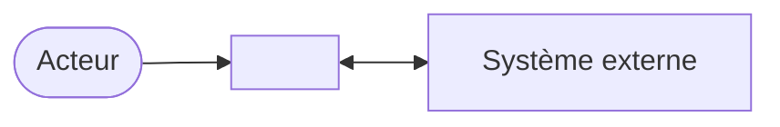

# 01 — Cadrage — <Nom du projet>

| Statut | Version | Date | Gate |
|---|---|---|---|
| Brouillon / Proposé / Validé / Révisé | 0.1 | <AAAA-MM-JJ> | G1 : — |

## 1. Vision

> **Pour** <public cible> **qui** <besoin ou problème>, **<nom du produit>** est un <catégorie> **qui** <bénéfice clé>. **Contrairement à** <alternative actuelle>, notre produit <différence essentielle>.

**Problème actuel** : <qui le subit, comment il est contourné aujourd'hui, ce que coûte l'inaction>

## 2. Parties prenantes

| Id | Partie prenante | Couche (produit, système, organisation, environnement) | Intérêt | Influence | Représentant |
|---|---|---|---|---|---|
| PP-1 | | | | Haute / Moyenne / Basse | |

## 3. Objectifs métier

| Id | Objectif | Indicateur | Valeur de départ | Cible | Échéance | Source |
|---|---|---|---|---|---|---|
| OB-1 | | | [seuil à fixer] | | | |

## 4. Périmètre

**Dans le périmètre**
- …

**Hors périmètre** (au moins trois éléments)
- …

**Plus tard**
- …

### Diagramme de contexte métier

## 5. Contraintes

| Id | Contrainte | Type (budget, délai, légal, technique, organisation) | Source | Négociable ? |
|---|---|---|---|---|
| C-1 | | | | Non |

## 6. Existant

| Élément existant | Nature (système, données, processus manuel, tableur) | Relation au projet (remplacé, intégré, conservé) | Données à reprendre ? |
|---|---|---|---|
| | | | |

## 7. Hypothèses et risques initiaux

Consignés dans les registres de `ETAT.md` : H-1…, R-1…

## 8. Profil du projet

**Profil retenu** : Prototype / Produit / Critique

**Justification** : <sensibilité des données, durée de vie, enjeux financiers ou humains, trafic>

## 9. Pistes de solution exprimées

<!-- Solutions évoquées par les parties prenantes pendant le cadrage : conservées
     ici pour la phase 5, sans valeur de décision (règle d'or 11). -->

- …
