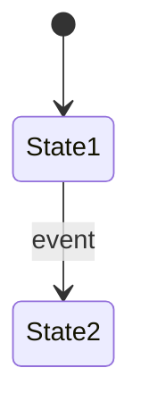

# 02 — Exigences fonctionnelles — <Nom du projet>

| Statut | Version | Date | Gate |
|---|---|---|---|
| Brouillon | 0.1 | <AAAA-MM-JJ> | G2 : — |

## 1. Conventions

Cadre Volere pour les exigences, Example Mapping pour les exemples. Chaque règle porte : **Règle**, **Critère de conformité**, **Exemples**, **Source**, **Justification**, **Priorité**.

Un critère de conformité doit produire un test qui échoue de façon déterministe. Ceux qui attendent une valeur du décideur sont marqués **[seuil à fixer]** et rattachés à une OD (décision ouverte).

Priorité : *Must* si le relâchement produit une erreur irrattrapable ou silencieuse ; *Should* s'il produit une erreur coûteuse mais visible ; *Could* pour le confort ; *Won't* pour l'exclu de cette version.

## 2. Acteurs

| Acteur | Partie prenante | Description |
|---|---|---|
| | PP-n | |

## 3. Inventaire des cas d'utilisation

| Id | Titre | Acteur principal | Objectif métier | Priorité | Contexte (phase 4) |
|---|---|---|---|---|---|
| UC-1 | | | OB-n | Must | |

## 4. Cas d'utilisation

### UC-1 — <Titre>

| Rubrique | Contenu |
|---|---|
| Acteur principal | |
| Objectif | |
| Objectif métier | OB-n |
| Préconditions | |
| Garanties en cas de succès | |
| Garanties minimales | |
| Règles appliquées | BR-n |
| Critères d'acceptation | CA-n |
| Priorité | |

**Scénario nominal**
1. L'acteur …
2. Le système …

**Extensions**
- 2a. Si …, alors le système …

## 5. Règles métier

### BR-1 — <Titre court>

- **Règle** : <énoncé unique, de préférence au format EARS (Easy Approach to Requirements Syntax)>
- **Critère de conformité** : <condition mesurable>
- **Exemples** :
  - BR-1.E1 (nominal) — Étant donné …, quand …, alors …
  - BR-1.E2 (limite) — Étant donné …, quand …, alors …
- **Source** : <PP-n, document, loi, décideur à une date>
- **Justification** : <pourquoi la règle existe>
- **Priorité** : <Must / Should / Could / Won't — conséquence du relâchement>
- **Cas d'utilisation** : UC-n

## 6. Critères d'acceptation

```gherkin
# language: fr
# CA-1 — vérifie UC-1, BR-1
Étant donné …
Quand …
Alors …
```

## 7. Compléments

### 7.1 Cycles de vie des objets métier



### 7.2 Matrice rôle × action

| Action | Rôle A | Rôle B |
|---|---|---|
| | ✓ | — |

### 7.3 Notifications

| Événement déclencheur | Destinataire | Canal | Contenu | Règle |
|---|---|---|---|---|

### 7.4 Écrans et parcours

| Écran | Cas d'utilisation | Maquette |
|---|---|---|

### 7.5 Reprise de données

<!-- Si l'existant contient des données à reprendre : sources, règles de transformation. -->
