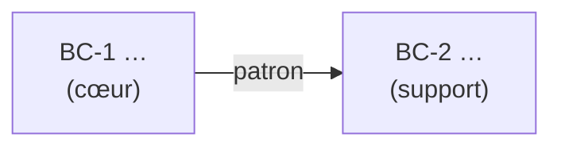

# 04 — Modèle du domaine — <Nom du projet>

| Statut | Version | Date | Gate |
|---|---|---|---|
| Brouillon | 0.1 | <AAAA-MM-JJ> | G4 : — |

## 1. Frise des événements métier

```
[Acteur: …] → (Commande: …) → {Agrégat: …}
    ⇒ <Événement: … (au passé)>
    ⇒ «Politique: quand …, alors …» (BR-n)
    ?? Point chaud: … → OD-n
```

## 2. Sous-domaines

| Sous-domaine | Type (Cœur, Support, Générique) | Justification | Stratégie (développer, simplifier, acheter) |
|---|---|---|---|
| | | | |

## 3. Contextes délimités

### BC-1 — <Nom>

| Rubrique | Contenu |
|---|---|
| Type de sous-domaine | |
| Responsabilité | |
| Ce qu'il ne fait pas | |
| Cas d'utilisation et règles | UC-n, BR-n |
| Événements publiés | |
| Événements et données consommés | |
| Agrégats pressentis | |

## 4. Carte des contextes



| Relation | Amont | Aval | Patron | Justification |
|---|---|---|---|---|
| | | | | |

## 5. Éléments tactiques des contextes *Cœur*

### BC-1 — <Nom>

| Agrégat | Invariants (BR-n) | Entités | Objets valeur | Événements émis (nom dans le code) |
|---|---|---|---|---|
| | | | | |
