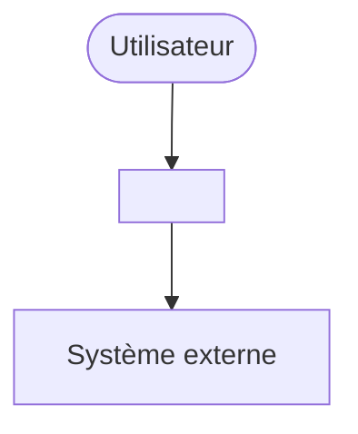
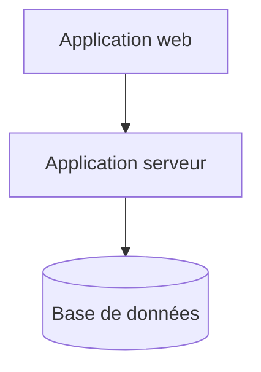
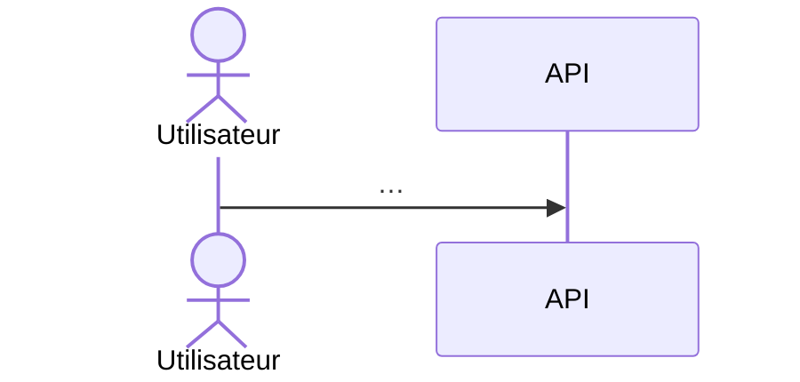

# 05 — Architecture — <Nom du projet>

<!-- Structure arc42. Les sections alimentées par d'autres phases renvoient aux
     livrables correspondants au lieu de les recopier. -->

| Statut | Version | Date | Gate |
|---|---|---|---|
| Brouillon | 0.1 | <AAAA-MM-JJ> | G5 : — |

## 1. Introduction et objectifs

Résumé de la vision (voir `01-cadrage.md`) et des scénarios qualité significatifs (voir `03-exigences-qualite.md`) :

| Scénario (QS) | Résumé | Traité par |
|---|---|---|
| QS-n | | ADR-nnnn |

## 2. Contraintes

Voir `01-cadrage.md` § 5. Contraintes qui pèsent sur l'architecture : C-n, …

## 3. Contexte et périmètre

Diagramme C4 (Context, Containers, Components, Code) de niveau 1 :

## 4. Stratégie de solution

| Dimension | Choix | ADR (Architecture Decision Record) |
|---|---|---|
| Découpage et déploiement | | ADR-0001 |
| Organisation interne des modules | | |
| Communication entre modules | | |
| Données et cohérence | | |
| Modélisation par contexte | | |

## 5. Vue des blocs de construction

### 5.1 Conteneurs (C4 niveau 2)

### 5.2 Correspondance contextes → modules

| Contexte (BC) | Module ou service | Organisation interne |
|---|---|---|
| BC-1 | | Hexagonale / En couches |

### 5.3 Composants des contextes *Cœur* (C4 niveau 3)

## 6. Vue d'exécution

### 6.1 UC-n — scénario nominal

### 6.2 Scénario de panne — <dépendance indisponible>

## 7. Vue de déploiement

<!-- Remplie en phase 9. -->

## 8. Concepts transverses

| Concept | Décision | ADR |
|---|---|---|
| Gestion des erreurs | | |
| Transactions et cohérence | | |
| Idempotence | | |
| Concurrence | | |
| Temps et fuseaux horaires | | |
| Configuration et secrets | | |
| Journalisation, métriques, traces | | |
| Validation | | |
| Internationalisation | | |
| Règles de dépendance (vérifiées par FF-n) | | |

## 9. Décisions d'architecture

| ADR | Titre | Statut | Exigences |
|---|---|---|---|
| ADR-0001 | | Proposé | QS-n, C-n |

## 10. Exigences qualité

Voir `03-exigences-qualite.md`.

## 11. Risques et dette technique

| R | Description | Réponse |
|---|---|---|
| R-n | | |

## 12. Glossaire

Voir `glossaire.md`.
