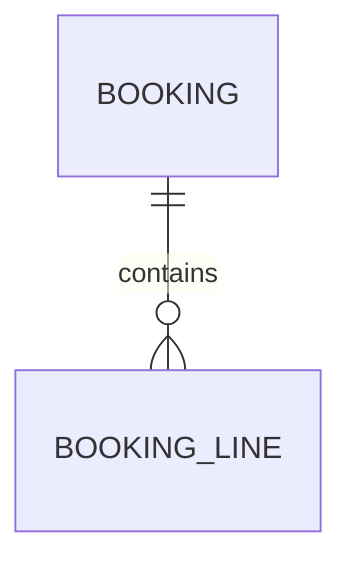

# 07 — Données et contrats — <Nom du projet>

| Statut | Version | Date | Gate |
|---|---|---|---|
| Brouillon | 0.1 | <AAAA-MM-JJ> | G7 : — |

## 1. Propriété des données

| Donnée | Contexte propriétaire | Consommateurs | Mode d'accès |
|---|---|---|---|
| | BC-n | | Interface / Événement / Copie en lecture |

## 2. Modèles logiques

### BC-1 — <Nom>

| Contrainte d'intégrité | Règle garantie |
|---|---|
| | BR-n |

## 3. Choix transverses

| Sujet | Décision | ADR (Architecture Decision Record) |
|---|---|---|
| Identifiants | | |
| Montants | | |
| Dates et heures | | |
| Suppression | | |
| Historique et audit | | |
| Multi-clients | | |
| Texte et encodage | | |

## 4. Classification et cycle de vie

| Ensemble de données | Sensibilité | Données personnelles | Conservation (durée, fondement) | Fin de vie | Volume |
|---|---|---|---|---|---|
| | | | | | |

## 5. Évolution du schéma

## 6. Reprise des données existantes

## 7. Règles de conception des interfaces

| Sujet | Règle |
|---|---|
| Nommage | |
| Erreurs | |
| Pagination, tri, filtre | |
| Idempotence | |
| Concurrence | |
| Versionnement | |
| Compatibilité et dépréciation | |
| Authentification | Voir `08-securite.md` |

Contrats : `contrats/openapi.yaml`, `contrats/asyncapi.yaml`.

## 8. Catalogue des événements

| Événement (nom dans le code) | Contexte émetteur | Consommateurs | Contenu | Livraison | Ordre | Version |
|---|---|---|---|---|---|---|
| | BC-n | | Notification / Transfert d'état | Au moins une fois | | 1 |

## 9. Intégrations externes

| Système | Contrat | Couche anticorruption | Authentification | Limites d'appel | Comportement si indisponible | Environnement de test |
|---|---|---|---|---|---|---|
| | | | | | QS-n | |
