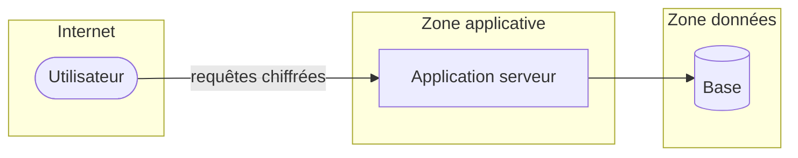

# 08 — Sécurité et conformité — <Nom du projet>

| Statut | Version | Date | Gate |
|---|---|---|---|
| Brouillon | 0.1 | <AAAA-MM-JJ> | G8 : — |

## 1. Diagramme de flux de données et frontières de confiance

## 2. Registre des menaces

<!-- Catégories STRIDE (Spoofing, Tampering, Repudiation, Information disclosure, Denial of service, Elevation of privilege). -->

| Id | Élément ou flux | Catégorie | Scénario | Vraisemblance | Impact | Réponse | Mesure | Vérification | Statut |
|---|---|---|---|---|---|---|---|---|---|
| M-1 | | | | | | | ADR (Architecture Decision Record) / BR-n / QS-n | | Ouverte |

## 3. Niveau d'exigence

Niveau ASVS (Application Security Verification Standard) visé : <1 / 2 / 3>. Exigences reprises : QS-n, BR-n.

## 4. Décisions de sécurité

| Sujet | Décision | ADR (Architecture Decision Record) |
|---|---|---|
| Authentification | | |
| Sessions et jetons | | |
| Autorisation | | |
| Validation des entrées | | |
| Chiffrement en transit et au repos | | |
| Secrets | | |
| Journalisation de sécurité | | |
| Protection contre les abus | | |
| Chaîne d'approvisionnement | | |
| Gestion des incidents | | |

## 5. Protection des données personnelles

| Traitement | Finalité | Base légale | Données | Durée | Droits des personnes (UC-n) | Sous-traitants | Transfert hors Union européenne |
|---|---|---|---|---|---|---|---|
| | | | | | | | |

Analyse d'impact requise : Oui / Non / À déterminer avec le juriste — justification.

## 6. Autres conformités

| Référentiel | Applicable ? | Contrainte créée |
|---|---|---|
| | | C-n |
